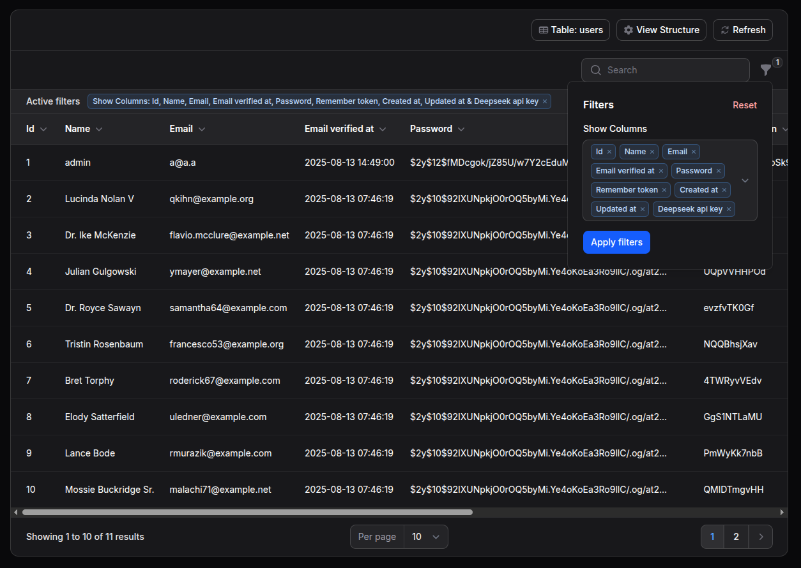

# Filaforge Database Viewer

A Filament v4 panel plugin that provides a database browser and data## Usage

After installation and registration, you'll find the "Database Viewer" page in your Filament panel navigation. The page provides:

- **Table Browser**: View all database tables with metadata
- **Schema Inspector**: Examine table structure, columns, and relationships
- **Data Preview**: Browse table records with pagination
- **Search & Filter**: Find specific records quickly
- **Column Details**: View data types, constraints, and indexes
- **Relationship Mapping**: Visualize foreign key relationships

Navigate to your Filament panel and look for "Database Viewer" in the sidebar to start exploring your database structure and data.

## Configuration

The plugin works with your default database connection. You can customize the viewer behavior by publishing the configuration:

```bash
php artisan vendor:publish --tag="database-viewer-config"
```

This will create a `config/database-viewer.php` file where you can modify display options and access controls.

## Security Notes

- **Read-Only Access**: The viewer provides read-only access to your database
- **Permission Integration**: Works with Filament's built-in authorization system
- **Safe Exploration**: No data modification capabilities

## Features

- ✅ Browse all database tables and views
- ✅ Inspect table schemas and relationships
- ✅ Preview table data with pagination
- ✅ Search and filter capabilities
- ✅ Column metadata display
- ✅ Foreign key relationship visualization
- ✅ Responsive design matching Filament's theme

---

**Package**: `filaforge/database-viewer`  
**License**: MIT  
**Requirements**: PHP ^8.1, Laravel ^12, Filament ^4.0for quick inspection of tables and records.



## Requirements
- PHP >= 8.1
- Laravel 12 (illuminate/support ^12)
- Filament ^4.0

## Installation

### Step 1: Install via Composer
```bash
composer require filaforge/database-viewer
```

### Publish (optional)

```bash
php artisan vendor:publish --provider="Filaforge\\DatabaseViewer\\Providers\\DatabaseViewerServiceProvider"
```

### Step 2: Service Provider Registration
The service provider is auto-discovered, so no manual registration is required.

### Step 3: Register the Plugin in Your Panel
Add the plugin to your Filament panel configuration in `app/Providers/Filament/AdminPanelProvider.php` (or your custom panel provider):

```php
<?php

namespace App\Providers\Filament;

use Filament\Http\Middleware\Authenticate;
use Filament\Http\Middleware\DisableBladeIconComponents;
use Filament\Http\Middleware\DispatchServingFilamentEvent;
use Filament\Pages;
use Filament\Panel;
use Filament\PanelProvider;
use Filament\Support\Colors\Color;
use Filament\Widgets;
use Illuminate\Cookie\Middleware\AddQueuedCookiesToResponse;
use Illuminate\Cookie\Middleware\EncryptCookies;
use Illuminate\Foundation\Http\Middleware\VerifyCsrfToken;
use Illuminate\Routing\Middleware\SubstituteBindings;
use Illuminate\Session\Middleware\AuthenticateSession;
use Illuminate\Session\Middleware\StartSession;
use Illuminate\View\Middleware\ShareErrorsFromSession;

// Add this import
use Filaforge\DatabaseViewer\DatabaseViewerPlugin;

class AdminPanelProvider extends PanelProvider
{
    public function panel(Panel $panel): Panel
    {
        return $panel
            ->default()
            ->id('admin')
            ->path('admin')
            ->login()
            ->colors([
                'primary' => Color::Amber,
            ])
            ->discoverResources(in: app_path('Filament/Resources'), for: 'App\\Filament\\Resources')
            ->discoverPages(in: app_path('Filament/Pages'), for: 'App\\Filament\\Pages')
            ->pages([
                Pages\Dashboard::class,
            ])
            ->discoverWidgets(in: app_path('Filament/Widgets'), for: 'App\\Filament\\Widgets')
            ->widgets([
                Widgets\AccountWidget::class,
                Widgets\FilamentInfoWidget::class,
            ])
            ->middleware([
                EncryptCookies::class,
                AddQueuedCookiesToResponse::class,
                StartSession::class,
                AuthenticateSession::class,
                ShareErrorsFromSession::class,
                VerifyCsrfToken::class,
                SubstituteBindings::class,
                DisableBladeIconComponents::class,
                DispatchServingFilamentEvent::class,
            ])
            ->authMiddleware([
                Authenticate::class,
            ])
            // Add the plugin here
            ->plugin(DatabaseViewerPlugin::make());
    }
}
```

### Step 4: Clear Cache and Discover Assets
```bash
php artisan config:clear
php artisan route:clear
php artisan view:clear
```

## Usage
Navigate to the “Database Viewer” page. Select a table to browse columns and preview data.

---
Package: `filaforge/database-viewer`## Filaforge Database Viewer

Browse tables and explore data from a Filament page.

Usage:

```php
->plugin(\Filaforge\DatabaseViewer\DatabaseViewerPlugin::make())
```

The page appears as "Database Viewer" in the admin navigation.


